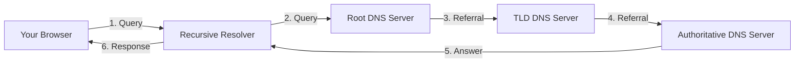

# DNS Server

> [!info] What is DNS?
> **DNS (Domain Name System)** is the internet's phonebook. It translates human-readable domain names (like `google.com`) into machine-readable IP addresses (like `142.250.80.46`).

---

## How DNS Works

When you type a URL in your browser, DNS resolves it through a series of lookups:


*requète*
### Step-by-Step Resolution

1. **Browser Cache** → Check if the domain is already cached locally
2. **OS Cache** → Check the operating system's DNS cache
3. **Recursive Resolver** → Query your ISP's DNS resolver (or a public one like `8.8.8.8`)
4. **Root Server** → Directs to the appropriate TLD (Top-Level Domain) server
5. **TLD Server** → Manages `.com`, `.org`, `.net`, etc.
6. **Authoritative Server** → Returns the final IP address for the domain

---

## Types of DNS Servers

| Server Type | Purpose | Example |
|---|---|---|
| **Recursive Resolver** | Client-side; handles queries on behalf of clients | Google Public DNS (`8.8.8.8`), Cloudflare (`1.1.1.1`) |
| **Root Name Server** | First step in translating domain names; directs to TLD servers | 13 root server clusters (A through M) |
| **TLD Name Server** | Manages domains under a specific TLD (`.com`, `.org`) | Verisign (`.com`), PIR (`.org`) |
| **Authoritative Name Server** | Holds actual DNS records for a domain | Your hosting provider's DNS |

---

## Common DNS Record Types

| Record | Purpose | Example |
|---|---|---|
| `A` | Maps domain to IPv4 address | `example.com → 93.184.216.34` |
| `AAAA` | Maps domain to IPv6 address | `example.com → 2606:2800:220:1:...` |
| `CNAME` | Alias pointing to another domain | `www.example.com → example.com` |
| `MX` | Mail server for the domain | `example.com → mail.example.com` |
| `TXT` | Text records (SPF, DKIM, verification) | `"v=spf1 include:_spf.google.com ~all"` |
| `NS` | Nameserver for the domain | `example.com → ns1.example.com` |
| `PTR` | Reverse DNS lookup (IP → domain) | `93.184.216.34 → example.com` |
| `SOA` | Start of Authority; zone metadata | Serial, refresh, retry, expire timers |

---

## DNS Caching & TTL

> [!tip] TTL (Time To Live)
> Every DNS record has a **TTL** value (in seconds) that determines how long resolvers should cache the response before querying again.

**Cache Layers:**

- **Browser cache** — Chrome, Firefox, etc. maintain their own DNS cache
- **OS cache** — System-level caching (e.g., `systemd-resolved` on Linux)
- **Router cache** — Some routers cache DNS queries
- **ISP resolver cache** — Your ISP's DNS servers cache responses

> [!warning] Stale DNS
> When you change DNS records, propagation depends on TTL. Low TTL = faster updates but more queries; high TTL = slower updates but less load.

---

## Useful Commands

```bash
# Linux
dig example.com                  # Detailed DNS lookup
dig +short example.com           # Quick IP lookup
nslookup example.com             # Simple DNS query
host example.com                 # Reverse lookup

# Windows
nslookup example.com
Resolve-DnsName example.com      # PowerShell

# macOS
dig example.com
dscacheutil -q host -a name example.com
```

---

## DNS Security

### DNSSEC

DNSSEC adds cryptographic signatures to DNS records to prevent:

- **Spoofing** — Fake DNS responses redirecting you to malicious sites
- **Cache poisoning** — Injecting false records into resolver caches
- **Man-in-the-middle** — Intercepting and modifying DNS queries

### DoH / DoT

| Protocol | Port | Description |
|---|---|---|
| **DNS over HTTPS (DoH)** | 443 | Encrypts DNS queries within HTTPS traffic |
| **DNS over TLS (DoT)** | 853 | Encrypts DNS queries using TLS |

> [!abstract] Why encrypt DNS?
> Traditional DNS is **unencrypted**. Anyone on your network (ISP, Wi-Fi admin) can see which domains you visit. DoH/DoT fix this.

---

## Public DNS Providers

| Provider | Primary | Secondary |
|---|---|---|
| Google | `8.8.8.8` | `8.8.4.4` |
| Cloudflare | `1.1.1.1` | `1.0.0.1` |
| Quad9 | `9.9.9.9` | `149.112.112.112` |
| OpenDNS | `208.67.222.222` | `208.67.220.220` |

---

## Related

- [[DNS server|← Back to Network Notes]]
- TCP/IP Stack
- HTTP/HTTPS Fundamentals
